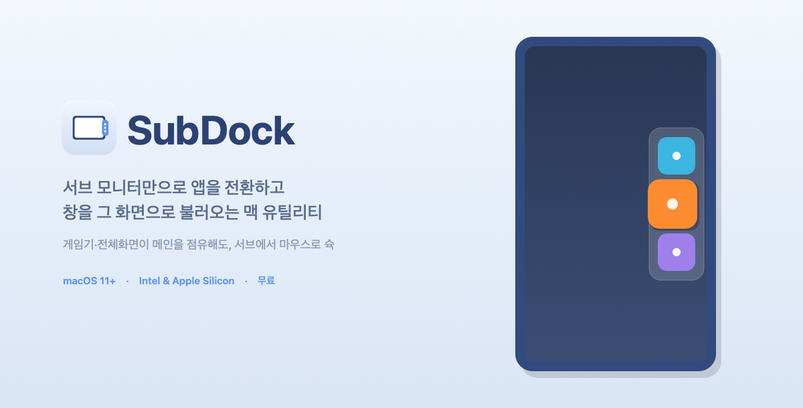

# SubDock

**[English](README.md) · 한국어**

**서브 모니터만으로 앱을 전환하고, 창을 그 화면으로 불러오는 맥 유틸리티**

메인 모니터가 게임기(PS5 등 외부 입력)나 전체화면 작업으로 점유돼 있을 때,
서브 모니터 가장자리에서 마우스만으로 앱을 전환하고 창까지 서브 화면으로 소환합니다.

---

## 이런 분께 딱

- 🎮 메인 모니터에 **게임기·셋톱박스 등 외부 입력**을 연결해 쓰는데, 서브 모니터는 맥으로 쓰는 분
- 🖥️ 메인에서 **전체화면 작업/영상**을 띄워두고 서브 모니터만 따로 조작하고 싶은 분
- 🖱️ 단축키 외우기보다 **마우스로 스윽 올려 클릭**하는 게 편한 분
- 📌 macOS 기본 Dock이 **메인 모니터에만 떠서** 불편했던 분

> Cmd+Tab이나 Raycast 같은 키보드 도구와 달리, SubDock은 **전환 UI가 서브 모니터에 뜨고**,
> 클릭한 앱의 **창을 서브 모니터로 직접 이동**시킵니다.

## 주요 기능

- 서브 모니터(또는 단일 화면) 가장자리에 **핸들** → 마우스 올리면 앱 목록이 펼쳐짐
- 클릭하면 앱 전환 + **최소화 복원** + **창을 해당 모니터로 이동**
- 메뉴바에서 **표시할 앱 자유롭게 설정** (고정/숨김/추가, 전체 앱 보기 토글)
- **핸들 표시 방식**(유색 탭 / 투명 전체 호버)과 **위치**(오른쪽/왼쪽) 선택
- **인텔 + 애플 실리콘** 모두 지원 (유니버설)
- 메뉴바에서 조용히 실행, 로그인 시 자동 시작

> **참고:** macOS **Finder**는 시스템 파일 관리자 특성상 서드파티 앱에 창 정보를 제공하지 않아,
> 서브 모니터로 이동시킬 수 없습니다(앞으로 꺼내기만 동작). 서드파티 파일 관리자 앱은 정상 동작합니다.

## 설치 방법

1. 아래 **Releases**에서 `SubDock-Installer.dmg` 다운로드
2. dmg를 열고 **SubDock을 응용 프로그램 폴더로 드래그**
3. 응용 프로그램에서 SubDock을 **우클릭 → 열기** (더블클릭 아님!)
   - "확인되지 않은 개발자" 경고가 뜨면 **열기** 클릭
   - ⚠️ 이 앱은 애플 공증을 받지 않아 첫 실행 시 경고가 뜹니다. 정상이며, 우클릭 열기로 실행됩니다
4. **시스템 설정 → 개인정보 보호 및 보안 → 손쉬운 사용**에서 SubDock 허용
   (창 이동 기능에 필요합니다)

## 요구사항

- macOS 11 (Big Sur) 이상
- Apple Silicon(M1~) 또는 Intel 맥

## 문의 · 피드백

버그 제보나 기능 제안은 [Issues](../../issues)에 남겨주세요.

## 후원 ☕

무료로 배포되는 앱입니다. 잘 쓰고 계시다면 커피 한 잔으로 응원해주세요!
(메뉴바 → "개발자에게 커피 한 잔 ☕")

---

© 2026 BlackCore. All rights reserved.
