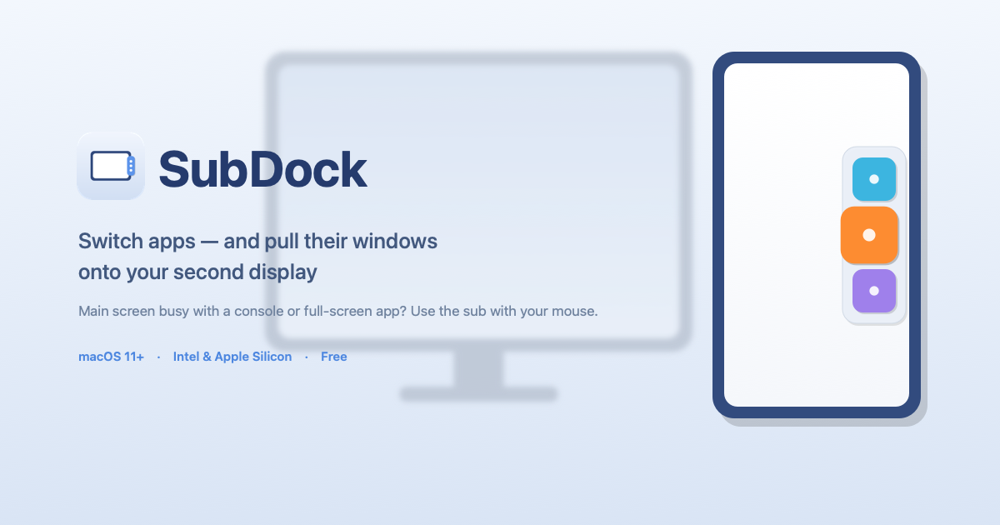

# SubDock

**English · [한국어](README.ko.md)**

**A menu-bar utility that switches apps and pulls their windows onto your second monitor — using the sub monitor alone.**

When your main display is occupied by a game console (PS5 and other HDMI inputs) or a full-screen app, SubDock lets you switch apps and summon their windows to the sub monitor with just your mouse — no need to look at the main screen.

---

## Who it's for

- 🎮 You run a **game console or set-top box on your main display** while the Mac shows on the sub monitor
- 🖥️ Your main screen is busy with **full-screen work or video**, and you want to control the sub monitor separately
- 🖱️ You'd rather **hover and click with the mouse** than memorize keyboard shortcuts
- 📌 The macOS Dock only appears on **one display**, which got in your way

> Unlike keyboard tools such as Cmd+Tab or Raycast, SubDock shows its **switcher on the sub monitor** and **moves the clicked app's window onto that monitor** — most tools only switch apps, leaving windows where they were.

## Features

- A **handle** on the edge of your sub monitor (or single display) → hover to reveal the app list
- Click an app to switch to it + **restore if minimized** + **move its window onto that monitor**
- Choose which apps to show from the menu bar (pin / hide / add, or show all running apps)
- Pick the **handle style** (colored tab / transparent full-edge hover) and **position** (right / left)
- **Universal** — works on both Intel and Apple Silicon
- Runs quietly from the menu bar, starts at login

## Install

1. Download `SubDock-Installer.dmg` from **Releases** below
2. Open the dmg and **drag SubDock into your Applications folder**
3. In Applications, **right-click SubDock → Open** (not double-click!)
   - If you see an "unidentified developer" warning, click **Open**
   - ⚠️ This app isn't notarized by Apple, so the first launch shows a warning. This is expected — right-click → Open runs it.
4. Grant access in **System Settings → Privacy & Security → Accessibility** for SubDock
   (required for the window-move feature)

## Requirements

- macOS 11 (Big Sur) or later
- Apple Silicon (M1+) or Intel Mac

## How to use

- Hover the **handle on the edge** of your sub monitor to reveal the app list
- Click an app to switch to it and bring its window onto the sub monitor
- Click the SubDock **menu-bar icon** to pin/add apps and change the handle style or position

## Feedback

Found a bug or have a feature idea? Please open an [Issue](../../issues).

## Support ☕

SubDock is free. If you find it useful, a coffee is always appreciated — an international support option is coming soon.

---

© 2026 BlackCore. All rights reserved.
